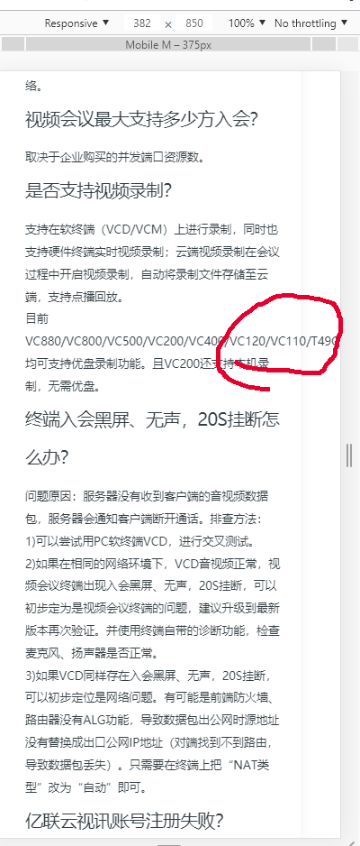
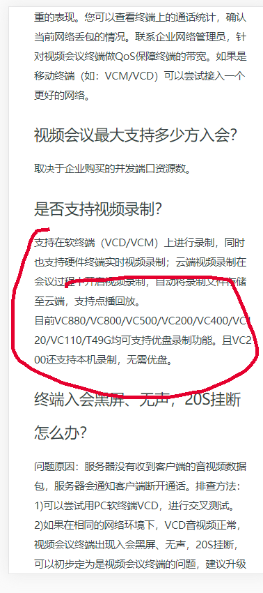

###文字换行

前言：目前在基于gatsby搞一个文档系统（帮助中心）,并且还要用响应式兼容移动端和pc。开发中遇到这样一个问题就是：

就是这样在移动端就莫名奇妙得溢出了而在pc端就完全没有问题, 而且看了其他得文章都没有问题可以正常显示，搜了一波 发现有word-break:break-all  word-wrap:break-word这两个属性可以解决这个问题。

1.  word-wrap: normal | break-word
normal: 只在允许得断字点换行（浏览器保持默认处理）
break-word: 在长单词或url地址内部进行换行

2. word-break： normal | break-all | keep-all

normal:使用浏览器磨人规则换行
break-all: 允许在单词内换行
keep-all: 只能在半角空格或连字符处换行

他们都可以使容器如div里面的内容可以自动换行，他们区别在于 word-break:break-all
假设在一个固定宽度 100px; 如果存在一个内容过长的情况，那么他会把这个单词截断成两端，
而word-wrap：break-word 他会把这个单词看成一个完整的整体，如果该行末端的宽度不够现实整个单词，他会自动把整个单词放到下一行。
就像上面图片的样子，其实是浏览器默认的，如果单词长度过长会直接移动到下一行，但是这个单词真的很长很长，单词不仅是会移动到下一行 同时还会溢出当前容器。并且在移动端页面width比较小的情况下，使用word-break：break-all比较好，可以省一些空间

感谢以下链接:
https://www.cnblogs.com/dashenjileige/p/10833340.html
https://www.cnblogs.com/lianghong/p/8011408.html