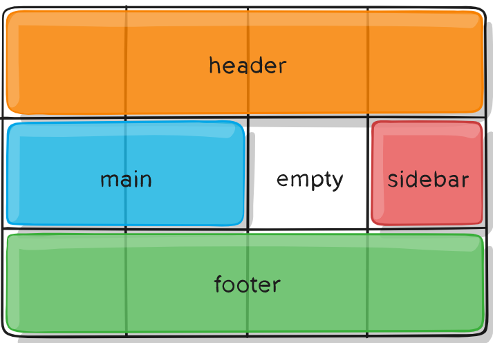

###网格布局

####引子
在一次修改别人页面的过程中,前作者用到了grid布局方法,而我现在就要在这个布局基础上做别的修改，之前考虑到grid的兼容性问题(ie全系不支持,chrome>57safari>10.1,ff>52,androidwebview>57, safari on ios>10.3,edge>16，同时还特别讨厌各种polyfill)也就一直搁置了，这次是得系统性的学习一下了

####概述
网格布局是弹性布局的升级版，他主要解决了 那种通过div 一行一行展示内容的问题，他可以将特定区域划分成一个个网格，做各种各样的布局。貌似像elementui antd的布局使用col 都用的网格布局
学习grid布局前需要知道一些基本的概念
1. 容器和项目，采用网格布局的区域，称为容器，容器内部采用网格定位的子元素称为 子项目
```
<div>
<div><p>1</p></div>
<div><p>2</p></div>
<div><p>3</p></div>
</div>
在这里面 最外层的div是容器，里面三个div分别是他的子项目
```
2. 容器里面的水平区域称为'行'垂直区域称为'列',而行和列交叉的区域就是单元格，这个和excel的概念类似，正常情况下n行m列  就会有  n x m个单元格，比如 3 x 3 = 9
3. 划分网格的线 称为‘网格线’，水平网格线划分出行 垂直网格划分为列，正常情况下n行有n+1根水平网络线 m列有m+1根垂直网格线。

一、容器属性
1. display:grid| inline-grid 区别就是容器对外变成一个行还是块级元素的区别
    有一个地方需要注意的是 一旦设置了网格布局后 容器子元素的float display:inline-block vertical-align 等全部失效
2. grid-template-colums,grid-template-rows : 可以使用绝对单位例如px 也可以用百分比或者剩余面积分配比例如1fr 2fr之类的
3. repeat() 有时候重写同样的值有点麻烦可以这样写 
 ```
 .a {display:grid;grid-template-colums:repeat(3,33.3%)   }
.b{display:grid;grid-template-colums:repeat(auto-fill,100px)} 注意这个auto-fill只能用于repeat中
.c {display:grid'grid-template-colums:1fr 1fr}并且可以和其他单位混合使用 
 ```
 auto-fill  有时候单元格的大小是固定的，容器大小不固定，可以使用铺满属性，使用auto-fill 关键字表示自动填充上面例子
4. minmax() 函数产生一个长度范围 接受两个参数 分别是最小最大
5. auto grid-template-column : 100px auto 100px 表示由浏览器自己决定长度，基本上等于该列单元格的最大宽度，除非单元格内容设置了min-max 这个值大于最大宽度
6. 网格线名称 .container{ display:grid;grid-template-colums: [c1] 100px [c2] 100px [c3] auto [c4]}. 网格布局允许同一根线有多个名字 
部分效果代码 可以看 'src/css/网格布局.html'
7. .a{display:grid;grid-template-colums:70% 30%},.b{repeat(12,1fr)}
8. grid-row-gap, grid-column-gap,grid-gap 设置行/列间距
9. 网格布局允许指定"区域"一个区域由单个或多个单元格组成，grid-template-areas 用于定义区域. 重复网格区域的名称会导致内容跨越这些单元格，一个点号代表一个空单元格。
```
.a{grid-area:header} .b{grid-area:main} .c{grid-area:sidebar} .d{grid-area:footer} .layout{grid-template-colums:repeat(4,50px),grid-template-rows:auto; grid-template-areas:
'header header header header'
'main main . sidebar'
'footer footer footer footer'};

```

10. 划分网格之后 容器的子元素会按照先行后列的规则去填充整个容器， 默认值是row 即先行后列 也可以改成column先列后行 grid-auto-flow:column. 同时还可以设置dense 属性即  grid-auto-flow: row dense 行优先，如果这一行有空余的空间会继续寻找可以填满这一部分空的空间的子项。
11. justify-itmes,align-items,place-items 属性设置单元格内容的水平位置(需要注意的是他是设置单元格内部内容的放置方式,单元格的位置不受影响)默认是stretch 拉伸。 可以用的属性  start end center stretch
12. justify-content,align-content,place-content 有时 网格总大小是会小于容器大小的，如果网格项都是用固定单位设置大小就有可能出现这种情况， 这种情况下可以设置网格容器内的网格对齐方式。注意这个属性是改变单元格位置的 跟其内部的内容没有什么关联，
.a{justify-content:start,end,center,stretch,space-around,space-between}具体的效果跟flex一样
https://codepen.io/matuzo/pen/vmpaWe/

感谢以下链接的分享:
https://www.html.cn/archives/8510
https://blog.csdn.net/csdn_zsdf/article/details/81630446
http://www.ruanyifeng.com/blog/2019/03/grid-layout-tutorial.html