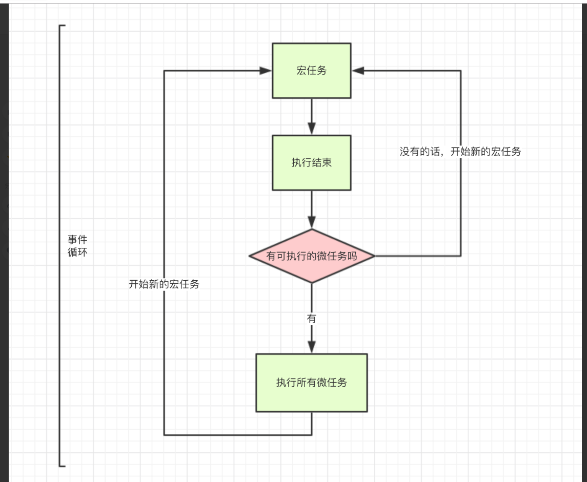

###eventloop运行机制

首先需要明确的是： javascript是单线程语言，开发过程必然会遇到异步请求的问题。所以自然就引出了javascript在浏览器中事件运行机制，eventloop。 eventloop有两个概念，宏任务和微任务，就是为了能够更好的解决js异步的问题的。

|宏任务|微任务|
|:--:|:--:|
|整体代码script(权限最大且最先运行)|Promise的后半部分需要对回调做处理的部分，promise除去回调部分仍然是宏任务属于script|
|settimeOut|process.nextTick|
|setInterval||

**整个js代码运行过程主要是这样的，整体代码script 开始运行，开始进行第一次循环。如果遇到宏任务的话，则将其放入宏任务的队列中，如果遇到微任务的话则把微任务放到微任务的队列里面，当这一个宏任务运行完毕后，会自动将当前的微任务队列里面的任务执行。这时候如果微任务的队列没有需要处理的任务后，那么下一轮循环开始，将宏任务队列加入的任务进行执行。此时进行第二轮循环，第二轮循环同第一轮一样，宏任务 微任务 如此往复 指到代码全部完成.**

>console.log('1');

>setTimeout(function() {
    console.log('2');
    process.nextTick(function() {
        console.log('3');
    })
    new Promise(function(resolve) {
        console.log('4');
        resolve();
    }).then(function() {
        console.log('5')
    })
})
process.nextTick(function() {
    console.log('6');
})
new Promise(function(resolve) {
    console.log('7');
    resolve();
}).then(function() {
    console.log('8')
})

>setTimeout(function() {
    console.log('9');
    process.nextTick(function() {
        console.log('10');
    })
    new Promise(function(resolve) {
        console.log('11');
        resolve();
    }).then(function() {
        console.log('12')
    })
})

输出结果是 1，7，6，8，2，4，3，5，9，11，10，12

理解setTimeout(()=>{
  task()
},3000)

sleep(100000000)

task()进入event table 并注册，计时开始
执行sleep 函数，很慢非常慢，计时仍在继续
3秒到了，timeout完成，task（）进入event queue 但是sleep还没有执行完
所以只能等
sleep执行完了 task() 终于从eventqueue 进入了主线程进行

如果设置为0 那么意思就是 住线程执行栈内的同步任务全部执行完成，栈为空就马上执行，