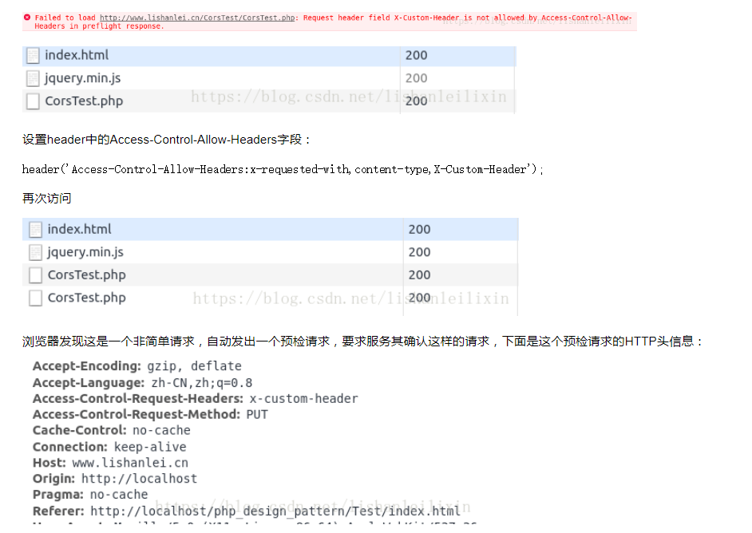

####前端跨域

只要是端口号 协议 域名有一个不一样就是跨域 浏览器会做拦截
CORS 跨域资源共享
是w3c的一个标准，全称跨域资源共享，允许浏览器向跨域服务器发出xmlhttprequest请求从而克服了ajax只能同源的问题
cors分为两种请求方式,一种是简单请求，一种是非简单请求区分条件
只要满足以下两大条件就属于简单请求
>(1) 请求方法是head get post
 (2) http的头部信息不超出以下几种字段: 
 accept
  accept-language
  content-language
   last-event-id
   content-type:（只限于三个值:application/x-www-form-urlencoded/ multipart/form-data text/plain）

不能同时满足两个条件就是非简单需求
浏览器直接发送cors跨域请求，并在header信息中加一个origin字段，表明这是一个跨域请求
>var url ='www.baidu.com'
 var xhr=new XMLHttpRequest()
 xhr.open('get',url,true)
 xhr.setRequestHeader(x-custom-header,value)
 xhr.send

上面的头信息origin字段用来说明本次请求来自哪个源（协议域名端口号）服务器根据这个值决定是否同意这次请求，如果origin指定的源 服务器不同意 服务器会返回一个正常的http回应，被xmlhttprequest捕获，

如果origin指定的域名在许可范围内，服务器返回响应会多几个头信息字段
比如
>access-control-allow-origin:该字段是必须的，其值可能是请求时origin字段的值也可能返回一个*表示接受任意域名的请求
access-control-allow-credentials:该字段可选，表示是否允许发送cookie，默认请求下cooike不不包括cors请求中，设置为true表示允许cooike接收
access-control-allow-headers: 该字段必须 ，他是一个都分割好的字符串，表明服务器支持的所有头信息字段

非简单需求
预检请求： **非简单请求的cors请求，会在正式通信前进行一次http查询请求，又称预检请求.浏览器先请求服务器当前网页所在域名是否在服务器许可名单中以及可以使用哪些http动词和头信息字段，当客户端得到肯定答复时候 浏览器才会发送请求**

>var url ='www.baidu.com'
 var xhr=new XMLHttpRequest()
 xhr.open('put',url,true)
 xhr.setRequestHeader(x-custom-header,value)
 xhr.send

上面代码用了put 并发送自定义头信息x-custom-header但是在服务器的头信息中没有x-custom-header 所以报错，只进行了一次预检请求

access-control-request-method: 该字段是必须的，用来列出浏览器的cors请求会用到哪些http方法
access-control-request-headers: 该字段是一个逗号分割的字符串，指定浏览器cors请求会额外发送的头信息字段

预检请求的回应：
当服务器收到预检请求后，检查了origin，access-control-request-method等信息字段后，如果没有问题，则允许跨域，

access-control-allow-methods: 该字段是必须的，其值是逗号分隔的一个字符串，表明服务器支持的所有跨域请求的方法，这是为了避免多次预检请求
如果浏览器否定了预检请求，会返回一个正常的http回应，但是没有任何cors相关的头信息字段。浏览器此时会认定服务器不同意 所以会触发一个错误

服务器端处理节制
1. 首先查看http头部有没有origin字段
2. 如果没有或者不允许，当普通请求
3. 如果有是允许的，在看看是否是prefight（method=options）
4. 如果不是简单请求，返回allow-origin,allow-header等字段，并返回正常内容
5. 如果是非简单请求，返回allow-headers，allow-methods

jsonp 
 1. 一个众所周知的问题，ajax直接请求普通文件会存在跨域无法访问的问题。对于网页而言存在一种情况是JavaScript的src的请求不存在跨域的问题，即浏览器同源策略是允许script标签的，所以可以使用jsonp的方案来进行跨域请求。
    具体的过程1. 前端设置好回调函数，并把回调函数当作请求url携带的参数。 2. 后端接受请求后，返回回调函数名和需要的数据， 3.后端响应并返回数据后，返回的数据传入到回调函数种并执行

> \
 \

 请求的这个js 直接返回 localhanlder({result:'aa'}) 这样就可以直接执行了
但是这里还有一个问题，就是这里完完全全就是静态请求的，而服务端可能会存在多个服务，如何让远程js知道应该调用本地函数的名字叫什么？ 
   这里有一个办法就是 在客户端动态生成一个script 同时script请求的url 带着需要请求的数据和需要本地调用的方法，这样后端获取url之后去做字符串的拼接，这样就可以解决问题了(因为scrpit标签请求到的内容就会自动执行)

> \

 这样实现编码的动态查询，也这是jsonp客户端实现的核心部分，url传递一个code参数，告诉服务器要请求的信息，而callback告诉服务器，为的本地回调函数脚flighthandler,所以请把查询结构传入这个函数中进行调用，
 所以服务器 返回一段执行回调函数  flightHanlder({result})

要注意的是 ： jsonp因为是请求 ，所以只能使用get 而不能用post等方式， 它和ajax本质上是不同的东西，ajax的核心是通过xmlhttprequest获取非本页内容，而jsonp的核心是动态添加js   无法检测jsonp请求是否失败；  可能存在安全隐患，josnp 如果服务器返回一些危险的代码那么可能会危害页面安全

感谢以下链接分享：
https://www.cnblogs.com/lishanlei/p/8823823.html