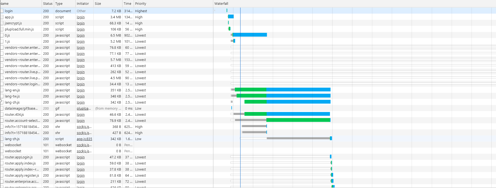
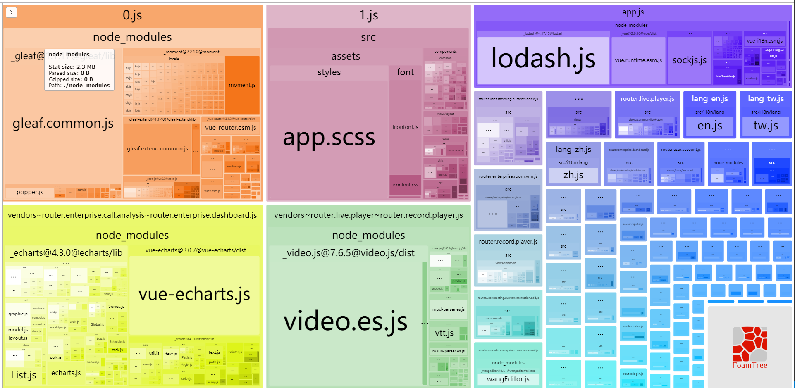

####记录一次优化项目
#####前言
接手了一个新的项目项目是基于vue开发的 用的脚手架vuecli3 初始化项目结构，所以创建vue.config.js 这个文件做额外的配置文件。
开发模式下 打开项目，发现首屏加载速度很慢,真的很慢,我特地打开手机的计时功能，从点开去缓存刷新到页面完全呈现出来，获取是那天网络状况不太好大概用了10秒钟。所以有了想优化这个项目的想法。

打开项目network发现开发环境的打包体积是13m（未压缩的情况下）开发环境下的首页 请求108个，52.7mb的资源 整体加载平均完毕时间 在7~9秒。呃。。。确实应该尝试搞一波优化在看看效果



#####分析问题
项目先安装一个webpack-bundle-analyzer,分析一下文件结构同时梳理项目业务代码发现了一些可以着手优化的点。

1. 引入的ui库采用全局引入,没有按需加载，
2. moment.js 大部分local语言的东西基本不需要 国际化也只是特定几个国家的语言，包含太多无用代码，
3. lodash体积有点大，考虑一波按需加载
4. webpack4 会默认给资源进行预下载，在网上也搜过相关prefetch的资料，很多人说是给下载资源打上prefetch标签，浏览器会它一个比较低的优先级，让他在闲时可以预下载。可是我的体验不是这样的，这个项目也同样默认设置了prefetch，同时路由也实现了懒加载，但是这个闲时下载大部分都是在contentload 和load 之间进行的下载，真真实实是有阻塞到了有用的资源的下载。并不是像我想象得那种在load结束之后 页面完全渲染完成之后‘偷偷的下载’
5. 项目有用到图表，貌似图表使用的也不多 基本以线型图和饼图 柱图为主。所以我觉得可以考虑一波优化
6. 在network里面发现 也确实存在部分资源包请求了两次（包含正式请求和预下载）的情况，这个还得结合一下业务代码看一下，为什么会产生这个情况？有没有对应得优化空间
7. video.es.js 这个东西 很大 暂时还不知道具体能干吗，先列入优化项中 后面在研究一下。

项目已经做了一部分优化了，在此把vue.config配置发一波

```
const UglifyJsPlugin = require('uglifyjs-webpack-plugin');
const CompressionWebpackPlugin = require("compression-webpack-plugin");
const PurgecssPlugin = require("purgecss-webpack-plugin");
const glob = require("glob-all");

const path = require("path");
const resolve = dir => path.join(__dirname, dir);
const IS_PROD = ["production", "prod"].includes(process.env.NODE_ENV);
const productionGzipExtensions = /\.(js|css|json|txt|html|ico|svg)(\?.*)?$/i;
// const BundleAnalyzerPlugin = require('webpack-bundle-analyzer').BundleAnalyzerPlugin

module.exports = {
  publicPath: '/',
  assetsDir: 'manager/',
  productionSourceMap: false,
  parallel: require("os").cpus().length > 1,
  devServer: {
    proxy: {
      '/manager/conference-manager': {
        target: process.env.VUE_APP_API_URL,
        ws: true,
        changeOrigin: true
      },
      '/manager/front': {
        target: process.env.VUE_APP_API_URL,
        ws: true,
        changeOrigin: true
      },
      '/manager/user-manager': {
        target: process.env.VUE_APP_API_URL,
        ws: true,
        changeOrigin: true
      },
      '/manager/conference-ctrl': {
        target: process.env.VUE_APP_API_URL,
        ws: true,
        changeOrigin: true,
        timeout: 1000 * 60 * 30,
      },
      '/manager/recording-stream-service': {
        target: process.env.VUE_APP_API_URL,
        ws: true,
        changeOrigin: true,
        timeout: 1000 * 60 * 30,
      }
    }
  },
  css: {
    modules: false,
    extract: false,
    sourceMap: false,
    loaderOptions: {
      sass: {
        data: `@import "@/assets/styles/variables.scss";`
      }
    }
  },
  configureWebpack: config => {
    if (IS_PROD) {
      const plugins = [];
      plugins.push(
        new PurgecssPlugin({
          paths: glob.sync([
            path.join(__dirname, "./src/index.html"),
            path.join(__dirname, "./**/*.vue"),
            path.join(__dirname, "./src/**/*.js")
          ])
        })
      );

      plugins.push(
        new UglifyJsPlugin({
          uglifyOptions: {
            warnings: false,
            compress: {
              drop_console: true,
              drop_debugger: true,
              pure_funcs: ['console.log']
            }
          },
          sourceMap: false,
          parallel: true
        })
      );

      plugins.push(
        new CompressionWebpackPlugin({
          filename: "[path].gz[query]",
          algorithm: "gzip",
          test: productionGzipExtensions,
          threshold: 10240,
          minRatio: 0.8
        })
      );
      config.plugins = [...config.plugins, ...plugins];
    }
  }  
  chainWebpack: config => {
    // 修复HMR
    config.resolve.symlinks(true);

    // 修复Lazy loading routes Error： Cyclic dependency  [https://github.com/vuejs/vue-cli/issues/1669]
    config.plugin("html").tap(args => {
      args[0].chunksSortMode = "none";
      return args;
    });

    // 添加别名
    config.resolve.alias
      .set("@", resolve("src"))
      .set("assets", resolve("src/assets"))
      .set("components", resolve("src/components"))

    config.module
      .rule('images')
      .use('image-webpack-loader')
      .loader('image-webpack-loader')
      .options({
        bypassOnDebug: true
      })
      .end()

    config.module
      .rule('svg')
      .exclude.add(resolve('src/assets/icons'))
      .end();

    config.module
      .rule('icons')
      .test(/\.svg$/)
      .include.add(resolve('src/assets/icons'))
      .end()
      .use('svg-sprite-loader')
      .loader('svg-sprite-loader')
      .options({
          symbolId: 'icon-[name]'
      });
      //分析模块
      if(process.env.use_analyzer){
        config.plugin('webpack-bundle-analyzer').use(require('webpack-bundle-analyzer').BundleAnalyzerPlugin)
      }
       config.plugins.delete("prefetch")
  }
}

```
代码中压缩图片,css,js,sourcetree,压缩体积,多线程打包是有做的在此不再赘述,接下来就是google,baidu寻找优化方法得时间..........................................................
1.ui组件库 按需加载，安装babel-plugin-component 并且进行相关的配置，具体可见elementui 上面有方法
2.关于日期库moment有点大，大主要原因是主动集成了很多国家的语言，所以我们可以删掉他们，或者使用day.js(moment有的它基本都有，而且还小)
3.lodash优化方法还是按需加载， cherry pick就可以了
```
import cloneDeep from 'lodash/cloneDeep'
import find from 'lodash/find'
const a = [...]
console.log(cloneDeep(a))
需要什么就 import lodash/ 方法名就可以 它的每一个方法都是一个独立的文件
```
4.关于这个设置prefetch的情况还是具体看项目，它可以全部关掉也可以部分关掉 。
```
config.plugins.delete("prefetch")
在webpackchain设置就行,vuecli也有相关教程
```
5. https://www.echartsjs.com/zh/tutorial.html#%E5%9C%A8%20webpack%20%E4%B8%AD%E4%BD%BF%E7%94%A8%20ECharts  具体可以看看echrts按需加载
https://segmentfault.com/a/1190000015453413?utm_source=tag-newest

6,7 这两个还真的需要看一下业务代码，不再赘述。


注:关于bundle-analyzer里面 几个属性的含义
stat: 这个大小是在进行压缩等转换之前的输入文件大小
parsed: 这个是文件最终输出的尺寸大小，如果有使用uglify等插件，这个值将会是你打包的最小尺寸
gzip:这个是包经过gzip压缩之后的大小，感觉这个功能是最牛批的体积可以大幅度减小，但需要后端开发的支持才行

感谢大佬们分享的链接：
https://www.jianshu.com/p/d2152789759d
https://juejin.im/post/5d0730e851882545bb404979
https://www.jianshu.com/p/3043d474fb86