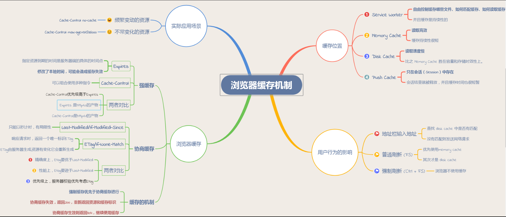
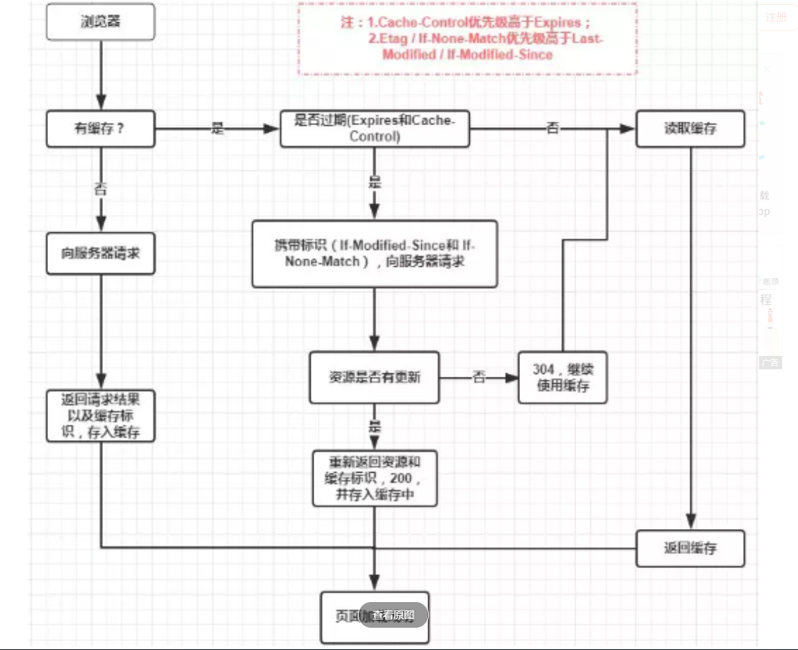

###http缓存

####前言 
对于一个网络请求来说可以分为:发起网络请求、后端处理、浏览器响应三个步骤。浏览器缓存可以帮助我们在第一和第三步骤优化性能，比如使用强缓存，直接可以不发起请求，或者协商缓存，发起了请求和服务器数据进行比对，通过判断来确定是否进行缓存或者获取数据

####缓存位置
1. service worker， 运行在浏览器背后的独立线程，一般可以用来实现缓存功能，使用service worker的话，传输协议必须是https， 因为service worker涉及到请求拦截。 service worker 的缓存与浏览器其他内建缓存机制不同，他可以让我们自由控制缓存哪些文件 如何匹配 读取。
 service worker 实现缓存的功能一般分为三个步骤：首先注册service worker，然后监听到install事件以后就可以缓存需要的文件，那么下次用户访问的时候就可以拦截请求的方式查询是否存在缓存。如果有就用 没有就请求数据

2. memory cache 主要包含的是当前页面中已经抓取到的资源，例如页面上已经下载的样式 图片脚本等。读取内存速度自然是快的，可是缓存的持续性会很短，会随着进程释放而释放，**一旦关闭tab 页面或者浏览器 也就释放掉了**
内存中有一块重要的缓存资源是preloader 相关指令（<link rel='prefetch'）下载的资源。需要注意的是**内存缓存在缓存资源时不关心返回资源的http缓存头cache-control是什么值，同时资源的匹配也并非仅仅针对url做匹配，也可能对content-type cors等其他特征做校验**
  
3.disk cache 速度相较于memeory 慢 但是胜在容量和实效性更好.在所有的浏览器缓存中，disk cache覆盖面是最大的，他会根据http header中的字段判断哪些资源需要缓存，哪些资源可以不请求直接使用，哪些资源已经过期需要重新请求，并且即使在跨站点的情况下，相同地址的资源一旦被硬盘缓存下来，就不会在区请求数据，
 
####缓存过程分析
浏览器与服务器通信的方式为应答模式： 浏览器发起http请求-服务器响应该请求，那么浏览器如何确定一个资源该不该缓存，若何去缓存呢，浏览器第一次向服务器发起请求后拿到请求结果后，将**请求结果和缓存标识**存入浏览器缓存，浏览器对于缓存的处理是根据第一次请求资源返回的响应头来确定的 

1.发起http请求之前需要判断 浏览器对应的资源是否有缓存，如果没有缓存（缓存数据和缓存标识）的话那么直接发起正常发送http请求， 服务器会将请求的结果和缓存规则一同发送给浏览器中，这个时候浏览器会将结果和标识 放入浏览器缓存中

**浏览器每次发起请求，都会现在浏览器缓存中查找该请求的结果以及缓存标识**
**浏览器每次拿到返回的结果都会将结果和缓存标识放入浏览器缓存中**

####强缓存
 强缓存不会向服务器发送请求，直接从缓存中读取资源，在chrome控制台可以看到该请求返回200 的状态码，并且size 显示 from disk cache 或者from memory cache。强缓存可以通过设置 httpheader实现： expires和 cacahe-control

 1. expires  缓存过期时间，用来指定资源到期的时间，是服务器端具体的时间点，expires = max-age +请求时间，需要和last-modifed 结合使用，expires是web服务器响应消息头字段，在响应http请求时告诉浏览器再过期时间前再次访问可以直接从浏览器缓存中拿不用再次请求。
    expires是http/1 的产物，受限于本地时间，如果修改了本地时间，可能造成缓存失效，因为这个时间是绝对时间。

2. cache-control 
  在http/1.1中，cache-control是重要的规则，主要用于控制网页缓存，比如当cache-control : max-age=300 则代表这个请求正确返回时间（浏览器会记录时间）的五分钟内再次加载资源就会命中强缓存，这个用的是相对时间，相对于本次的时间，所以明显比expires好用不少

**cache-control 可以在请求头或者响应头中设置，并且可以组合多种指令**

|指令|作用|
|:-:|:-:|
|public|表示响应可以呗客户端和代理服务器缓存|
|private|响应只可以被客户端缓存|
|max-age=30|缓存30秒后过期，需要重新请求|
|s-maxage=30|覆盖max-age 作用一样，只是在代理服务器中生效|
|no-store|不缓存任何响应|
|no-cache|资源会被缓存，但是立即失效，强制所有缓存了该响应的用户，在使用缓存数据之前，会发起请求验证资源是否过期|
|max-stale=30|30秒内。即使缓存过期也用这个缓存|

public 所有的对象（客户端和代理服务器都可缓存）都可以接受这部分缓存，比如有中间转发的proxy缓存了这部分后，下次在请求同一资源，proxy直接发给你了 不用在请求了
private 所有内容只有客户端可以缓存，那么意味这proxy 无法缓存，只能老老实实给你转发请求
**no-cache 是否使用缓存需要经过协商缓存来验证决定，表示不使cache-control的缓存控制方式做前置验证，而是使用etag和last-modified字段来控制缓存，需要注意的是 no-cache 这个名字有误导，设置了no-cache之后不是说浏览器不缓存数据了，只是浏览器再使用缓存数据的时候，需要先确认一下数据是否还跟服务器保持一致**
no-store 不缓存数据 
max-age 表示在缓存多少秒后失效
s-maxage 只是在代理服务器中生效（如cdn） 比如s-maxage=60 在这60秒钟，即使更新了cdn的内容，浏览器也不会进行请求，max-age用于普通缓存 s-maxage用于代理缓存，s-maxage优先级高于max-age

expires和cache-control对比
两者区别不大，区别在与expires 是http1 产物 cache-control是http1.1的产物。cache-control优先级更高，
那么强缓存判断是否缓存的依据来自于是否超出某个时间段或者时间，而不关心服务器端文件是否已经更新，这可能导致加载文件不是服务器端最新的内容，那么我们如何得知后端内容是否已经发生了更新呢？这时需要用到协商缓存

####协商缓存
**协商缓存就是强缓存失效后，浏览器携带缓存标识向服务器发起请求，由服务器根据缓存标识决定是否使用缓存的过程** 协商缓存生效返回304 否则正常发送请求 拿回数据。流程如下
1. 浏览器发送请求，->这时强缓存失效，浏览器携带该资源的缓存标识发起请求-> 服务器返回请求回应，
这里就会有个分支，如果服务器认为资源不需要更新 那么直接返回304 表示资源不要更新，那么浏览器使用缓存数据。 否则服务器发送新的资源和标识 给浏览器，浏览器资源更新 返回200 并将新的标识和数据更改

**协商缓存可以通过设置http header实现：last-modified和etag**

1. last-modified和if-modified-since
 浏览器再第一次访问资源时，服务器返回资源的时候在response header中添加 modified的header 这个值是这个资源在服务器上的最后修改时间，浏览器接受后缓存文件和header,
 >last-mofified: fri,22 jul2016 01:47:00 gmt

  浏览器下一次请求这个资源，浏览器会检测last-modified这个header，于是添加if-modified-since这个header，值就是last-modified中的值，服务器再次收到这个资源请求，会根据if-modified-since 中的值与服务器这个资源的最后修改时间做对比，如果没有变化 直接304 取缓存，如果if-modified-since的世界小于服务器这个资源的最后修改时间，那么说明文件有更新，直接请求资源 返回200

  browser                            server
            get/ doge.png http/1.1--->
        <--- http/1.1 200ok last-modified:fri,22 jul 2016 01:47:00
        get /doge.png http/1.1 ,if-modified-since:fri,22 jul 2016 01:47:00 --->
        <--- http/1.1 304 not modified

但是last-modified 有一些弊端
  1.如果本地打开缓存文件，技术没有对文件进行修改，但是还会造成last-modified被修改，服务端不能命中缓存导致发送相同的资源
  2.last-modified 精度是秒，如果在一秒内完成文件修改，那么服务端会认为资源命中了，不会返回正确的资源。

正因为有这些弊端，所以正如expires的命运一样 last-modified的替代品出现了，就是etag和if-none-match

2.etag和 if-none-match
 **etag是服务器响应请求时，返回当前资源文件饿的一个唯一标识（服务器生成），只要资源有变化，etag就会重新生成**，浏览器再下一次加载资源向服务器请求时，会将上一次返回的etag值放到request header里的 if-none-match中， 服务器只需要比较传来的if-none-match跟自己的etage比较一下就可以，匹配上说明没有问题返回304让客户端继续用本地资源，如果不一致则正常请求资源。注意：etag 的优先级是大于if-modified的
####缓存机制
 **强制缓存优先于协商缓存进行，若强缓存(expires,cache-control，通过比较max-age或者expires的时间来确定是否需要使用强缓存)生效，则直接使用缓存,若不生效则使用协商缓存(last-modified/if-modified-since,etag/if-none-match)协商缓存由服务器决定是否要使用，若协商缓存失效则正常发送请求，若成功则返回304继续使用缓存**

注：如果什么缓存策略都没有设置，那么浏览器会怎么处理？ 他会有一个启发式算法，通常会取响应头中的date减去last-modified值的10%作为缓存时间

####使用场景
>cache-control:no-cache

对于频繁改变的资源，首先使用cache-control：no-cache 使浏览器每次请求服务器，然后配合etag或者last-modified 来验证资源是否有效，
对于不常变化的资源 
> cache-control:max-age=333333333

配置一个很大的max-age 这样就可以一直用强缓存了。为了解决更新问题，需要在文件名添加hash这样让之前的强制缓存失效

####用户行为对浏览器缓存的影响
所谓用户行为对浏览器缓存的影响，指的就是用户在浏览器进行操作时会触发怎样的缓存策略

1.打开网页/跳转、前进后退、新开窗口，地址栏输入地址;查找disk cache 是否有匹配，有则用没有就请求，
2.普通刷新F5，tab没有关闭，所以可以用memorycache 其次就是disk cache
  强缓存无效，协商缓存有效 
3.强制刷新ctrl F5，浏览器不使用缓存，请求头带有cache-control：no-cache，强、协商缓存都无效

感谢一下博客的内容分享： 
https://www.jianshu.com/p/54cc04190252
https://www.cnblogs.com/ranyonsue/p/8918908.html 
