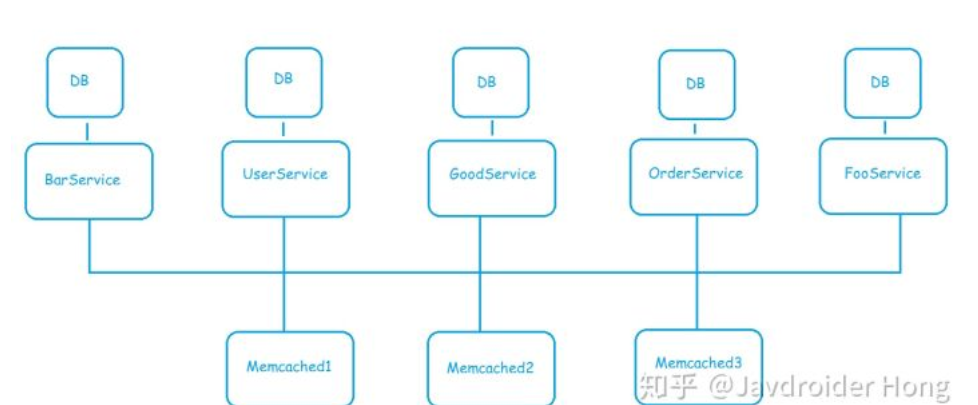

####集群,分布式,微服务概念
项目中用node请求资源的时候会根据nginx 做一个请求的调度这里会涉及到了集群的知识， 这里学习一下集群 分布式 微服务的基本概念和区别

集群和分布式其实都是为了解决网络请求数量过大并发过高 的问题。

 集群：就是同一个业务，部署到多个服务器上，通过一系列的请求调度 共同分担请求压力，他们几个服务器的代码和服务是一模一样的，

分布式：把一个完整的业务链分拆成多个子业务，分别部署在不同服务器上。协同合作去耦，比如将一个大的商城业务分割成 订单查询 用户查询 物流查询 商品列表 。在整个体系中 订单查询 商品查询占请求的大多数，那么就可以给他们分配更多的资源来做这个事情。彼此之间的结构 功能不同。并且其中某一个服务崩溃了 不至于整个服务都不能用，他们彼此是分开的。
而微服务其实算是一种部署的架构，微服务的应用不一定是分散在多个服务器上 他也可能是同一个服务器

感谢以下链接分享:
https://blog.csdn.net/jiangyu1013/article/details/80417961
https://blog.csdn.net/m0_37125796/article/details/80373417
https://blog.csdn.net/qq_37788067/article/details/79250623