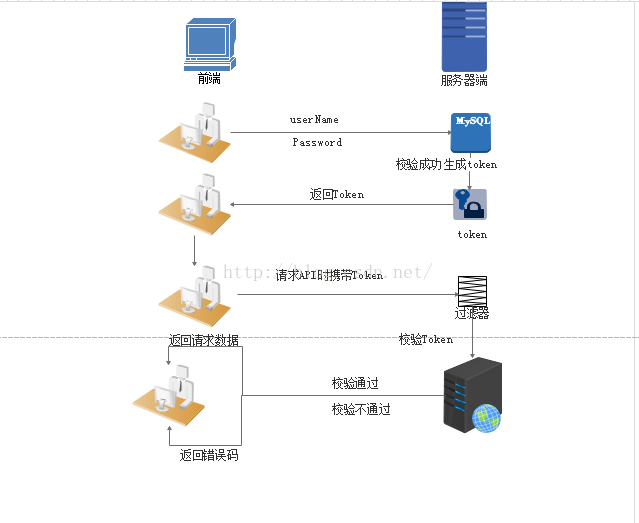

###cooike session token 认证机制
#####为了便于理解他们之间的区别，要先说一下cooike 和session模式和web交互的发展

1. 发展史
早期的web基本上就是文档的浏览而已，既然是浏览，作为服务器不用记录谁在某一个时间段里面都浏览了什么文档，因为http是无状态协议，对于服务器来说每个请求都是新的。 随着web应用不断发展 这时候就需要 使用到会话管理了，必须记住哪些人登录系统，哪些人往自己购物车中放商品，必须要将每个人区分开，因为http协议是无状态的，所以想的一个办法就是给大家一个session id 给每个人一个独特的标识,当每一个客户端请求过来的时候 把sessionid set-cooike 方式添加到客户端的cooike 的请求头中，这样客户端每次请求都会带上这个cooike 服务器就可以识别到了

2. cooike
 cooike 由服务器生成，发送给浏览器，浏览器把cooike以k-v形式保存到下来存到某个目录下，下一次请求同一个网站时
会自动把cooike带上

3. session
 就是会话，服务器要知道当前发送请求给自己的是谁，为了做这种区分，服务器要给每一个客户端分配不同的身份标识，然后客户端每一次向服务器发请求的时候 都会带上这个 身份标识，服务器就知道了这个请求来自于谁了，至于客户端怎么保存身份标识 有很多方式， 对于浏览器客户端 就是cooike 。  服务器使用session把用户的信息临时保存在服务器上，用户离开网站后session会被销毁，这种用户信息存储防水相对于cooike更安全 可也有个缺陷，分布式架构下 session会丢失，因为负载均衡下可能ip会重定向到别的ip上去。 而且当服务器上访问的用户多了的话 那服务器就需要保存非常多数量的session，这对于服务器来说是一个不小的开销。 后来有一个想法就是搞一个专门存储sessionid的地方 将所有的存储过去，但是也增加了单点失败的可能性，那个负责存储session服务器挂了的话，所有人都要重新登陆一次 ，非常不友好的架构。

 

4. session 和 cooike 区别  
 session 是存储在服务器上，cooike是存储在客户端上，所以session安全性会更高。
 session里的信息是通过存放在会话cooike里的session id 获取的，session是存放在服务器的内存中，所以session里的数据不断增加会造成服务器负担，所以会把很重要的信息 存储在session中，次要的东西存储在客户端cooike中 
 cooike 分为会话cooike 持久化cooikd  前者是放在客户端浏览器内存中，生命周期和浏览器是一致的，浏览器关闭了会话cooike也就结束了 
 而持久化cooike是放在硬盘中的，就像有一些网站例如掘金 登录过一次之后 即使关闭浏览器 以后在进入页面 是可以直接进入登录状态的 不用在输入账号和密码了。 

5. token 令牌
 随着web 移动端的兴起用户数量庞大。 cooike session已经不适用了，
  1.session 数量过大内存压力过大。
  2.可扩展性问题， session传递问题 在一个集群里面 这个问题很难搞，还有单点登录问题 第三方登录问题
  3.csrf 跨站请求伪造， 当用户在访问一些信息非常敏感的网站时 例如银行， 很容易遇到csrf跨站请求伪造，利用服务器验证session 直接让客户端变得很危险。

4.token也称作为令牌，由uid+time+sign[签名 ，固定参数],token在客户端一般存放于localstorage cooike 或者sessionstorage中，在服务器一般存于数据库中。

5.token 是一种服务器用时间换空间的一种方法。每一次客户端发送请求都会携带token 服务器要进行解析 判断是否是合法用户，并且token还会设置一个生存时间，长时间不请求token失效 需要重新登录。

6. token验证原理
 基于token验证
 

每一次请求都需要token token应该在http头部发送从而保证了http  请求无状态，我们同样通过设置服务器属性 access-contorl-allow-origin 让服务器接收所有请求，

感谢以下链接分享:
https://my.oschina.net/u/3908739/blog/1941216
https://www.cnblogs.com/wxinyu/p/9154178.html
https://segmentfault.com/a/1190000017831088