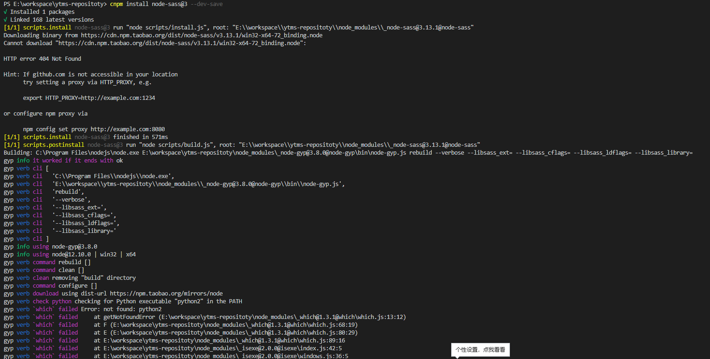
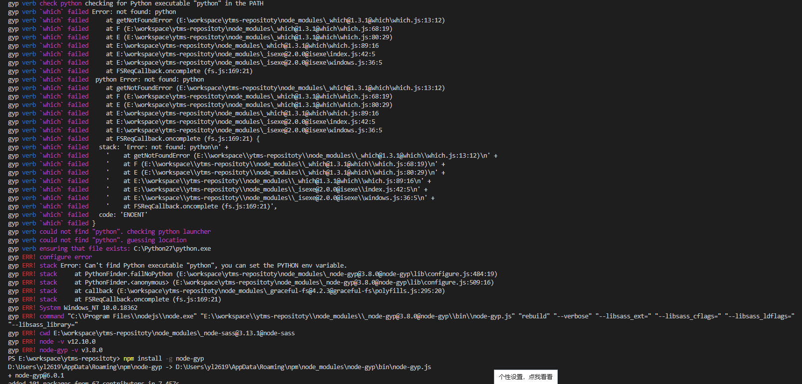

#####记一次node-sass 安装遇到的问题
vue项目使用scss写样式，自然需要用到node-sass,sass-loader 这两个依赖的包了。当安装到node-sass 时遇到一个这样的报错:



从报错"not found python2  checking for python executable python2 in the path ;  can't find python executable python you can set the python env variable"来看说是找不到python，找不到python来执行这个文件 可以设置python的变量来解决这个问题。所以~~~ 不是很明白安装node-sass为啥和python扯上关系，于是搜了一波资料，

>node-gyp，是由于node程序中需要调用一些其他语言编写的 工具 甚至是dll，需要先编译一下，否则就会有跨平台的问题，例如在windows上运行的软件copy到mac上就不能用了，但是如果源码支持，编译一下，在mac上还是可以用的。node-gyp在较新的Node版本中都是自带的（平台相关），用来编译原生C++模块。

node-sass在安装过程中还真会调用一些python的东西来执行，好在有大佬帮我们想好了对策
npm install -g --production windows-build-tools 
安装一个windows相关环境的语言包,这个包包含python 2.x , visualc++, .net 
安装好了之后 在npm install -g node-gyp  

有一个问题需要注意的是:安装过程中会遇到有个问题
```
Please restart this script from an administrative PowerShell!
The build tools cannot be installed without administrative rights.
To fix, right-click on PowerShell and run "as Administrator".
```
翻译过来大体意思就是 在有管理员权限的powswershell来安装 工具不能再没有权限的平台来安装，
这个有一个解决办法，就是打开window菜单 输入cmd，检索出cmd相应的图标后 有击 ‘管理员权限登录’ 打开cmd 然后继续执行命令 就可以了
安装成功后会有相关安装成功的提示，之后回到项目把没有安装成功的node-sass , sass-loader全部用npm卸载掉 重新安装就解决了这个问题


感谢以下链接分享:
https://www.cnblogs.com/wangyuxue/p/11218113.html