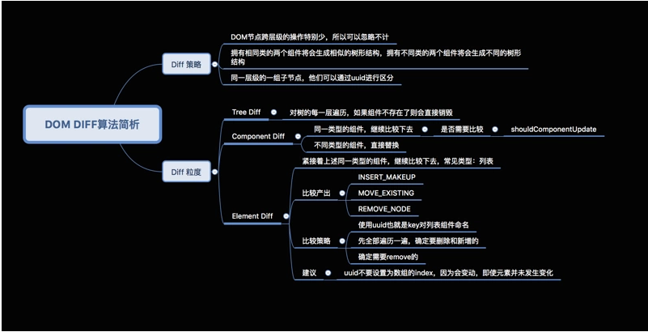

###dom diff && fiber

react diff:
 react采用虚拟dom技术实现对真实dom的映射，即react diff算法的差异性查找实质是对两个js对象的差异查找，
 react diff基于三个策略：
 1. web ui中dom节点跨层级移动操作非常少，可以忽略不计（tree diff）
 2. 拥有相同类的两个组件会生成相似的树形结构，拥有不同类的两个组件会生成不同的树形结构(component diff)
 3. 对于同一层级的一组子节点，他们可以通过id进行区分(element diff)

  

  1. 在react中比较两个虚拟dom节点要分为两种情况：1,节点类型不同2.节点类型相同但是属性不同。
  第一种情况，当在树中的统一位置输出了不同类型的节点，react直接删除前面的，创建一个新的后面的并插入，
  > rendera:\

    renderb:
    => [removenode div],[insertnode span]
  
  当一个节点从div变成span，直接删除div 创建span并插入，需要注意的是react做的是同层比较，假设这个父一级的节点删除了 那么后面跟着的子节点一样全部删除掉，他们也不用于比较，这就是复杂度能够降低到o(n)的原因
  组件同理,当同一个位置遇到不同的组件也是这样做  

  相同节点比较  react会直接进行属性替换 
  列表节点比较  对于不在同一层的节点比较，即使他们完全一样也会被毁掉后重建，那么当他们在同一层时 就会用到列表节点的比较规则了。 我们在开发中经常会遇到有警告遍历一个对象或者数组的时候要给他们添加唯一标识的key 其目的就是为了提高性能，如果没有标识，react无法识别每一个节点，那么更新过程就会很低效，特别是节点存在增加 删除的那种，几乎会遍历整个列表重新搞，而如果加入了key react可以识别，同时可以找到正确的位置进行排列

   2. 首先要明确的是只有在react更新阶段才会使用diff算法。 react更新阶段会对reactelement 类型判断而进行不同的操作，reactelement类型包含三种：文本，dom conmponent。 
    不同类型的元素更新处理方式： 自定义元素的更新主要是更新render出的节点，render出的节点对应component去管理更新。  text节点直接更改文字就可以了。   浏览器基本元素更新分成两块，1更新属性，对比前后属性的不同局部更新。  2.子节点更新，子节点更新主要是找出差异对象，找差异对象的时候会用上shouldupdatereactcomponent来判断
  

注: 事实上diff算法只被调用于react更新阶段的dom元素更新过程，如果更新为文本类型，内容不同就直接替换根本不会用diff算法 。  

     
 

####fiber架构

感谢以下链接分享：
https://www.kancloud.cn/kancloud/react-in-depth/67091
https://segmentfault.com/a/1190000016539430 
https://blog.csdn.net/sinat_17775997/article/details/93383254
https://segmentfault.com/a/1190000018250127?utm_source=tag-newest