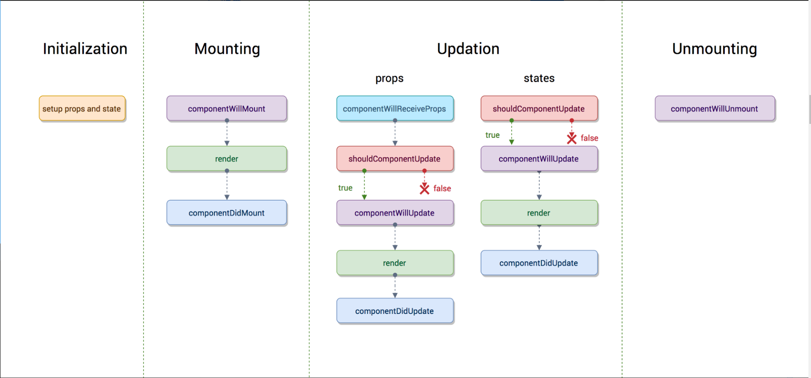

### react 生命周期的学习(16.8之前和之后)
 (很多旧的方法即将废除，新的react项目中不建议在使用旧生命周期方法,着重记录新生命周期下的新方法以及和旧的做对比，不在赘述旧的生命周期相关概念)

新生命周期依旧是分为:挂载、更新、卸载 三个阶段

挂载:{
    1. constructor(),  构造函数，用来进行数据的初始化的设置，在react组件挂载之前会调用构造函数，在为react.Component 子类实现构造函数时应在其他语句之前调用super(props),否则会有undefined的bug  (多积累一些派生状态的一些用法 memoization heplper key等)
    **注意： 避免将props的值直接赋值给state**
    2.static getDerivedStateFromProps(props,state), 会在render()方法之前调用，并且在初始挂载及后续的更新都会被调用，它应返回一个对象来更新state，如果返回null 则不更新任何内容 可以类比旧生命周期的 ComponentwillReceiveprops .因为是类方法，此方法无法访问组件实例，
    3. render() 当render被调用时 会检查this.props和 this.state 的变化并返回渲染  (shouldComponentUpdate() 返回false 则不会调用render)
    4.componentDidMount() 会在组件挂载后（插入dom树中）立即调用。依赖于dom节点的 初始化应该放在这里，如需要通过网络请求获取数据，此处是实例化请求的好地方
}

更新:{
  1. static getDerviedStateFromProps(props,state),
  2. shouldComponentUpdate(nextProps,nextState), 根据返回值来判断，react组件的输出是否受当前state或者props 更改的影响，默认行为是state每次发生变化组件都会重新渲染。当props state发生变化时会在渲染执行之前调用shouldCompnentUpdate 返回值默认是true，首次渲染或使用forceUpdate（） 不会调用该方法   PureComponent 会对props和state进行浅层比较 减少跳过必要更新的可能性
  不建议在shouldComponentUpdate() 中进行深层比较或者使用JSON。stringify() 这样非常影响效率 会损害性能  总之不建议去手动编写这个方法即使要编写 可以将this.props nextprops this.state nextstate 进行比较 并且返回false 不会阻止子组件在state更新时重新渲染
    pureComponent 进行的只是浅比较，可以理解为比较数值，对于一些引用类型的数据 应该是不灵了， 如果真的有特殊需求的话 还是可以用自定义的方法来写shouldcomponentupdate
  3. render()
  4. getSnapshotBeforeUpdate() 在最近一次渲染输出（提交到dom节点）之前调用。
  5. componentDidUpdate(prevProps,prevState), componentDidUpdate()会在更新后立即调用，首次渲染不会执行此方法  当组件更新后可以对此处的dom进行操作，如果你对更新前后的props进行了比较 也可以选择在此处进行
  网络请求（例如当props没有发生变化时 则不会请求网络）
  > componentDidUpdate(prevprops){
    if(this.props.userid !== prevprops.userid){
      this.fetchdata()
    }}

   注意setstate 必须要包裹在条件语句中不然小心死循环， 
    
}

多组件生命周期执行顺序
 
 挂载阶段 
   1. 父组件开始执行到自身的render 解析其下有哪些子组件需要渲染，对正常的子组件进行创建。各个子组件指到执行至 render 生成到父子组件对应的virtual dom 树，并合并 
   2. 此时dom节点生成完毕，组件挂载完成 先是触发同步子组件各自的componentDidMount 最后触发父组件

  >父组件 getDerivedStateFromProps —> 同步子组件 getDerivedStateFromProps —> 同步子组件 componentDidMount —> 父组件 componentDidMount —> 异步子组件 getDerivedStateFromProps —> 异步子组件 componentDidMount

  更新阶段
    1. 第一阶段 由父组件开始 执行
        static getDerivedStateFromProps ,shouldComponentUpdate
    更新到自身的render 解析其下有哪些子组件需要渲染，并对子组件进行创建，挨个执行各个组件至render 生成到父子组件对应的virtual dom 树，进行计算 dom操作
    2. dom树挂载完成，显示触发同步子组件 getsnapbeforeupdate  componentdidupate 后面触发父组件

    > 父组件 getDerivedStateFromProps —> 父组件 shouldComponentUpdate —> 子组件 getDerivedStateFromProps —> 子组件 shouldComponentUpdate —> 子组件 getSnapshotBeforeUpdate —>  父组件 getSnapshotBeforeUpdate —> 子组件 componentDidUpdate —> 父组件 componentDidUpdate

    卸载阶段是先执行父的 后面再执行子的 componentwillunmount()

>  后面多组件的笔记源：https://juejin.im/post/5d3db4da518825016f644561