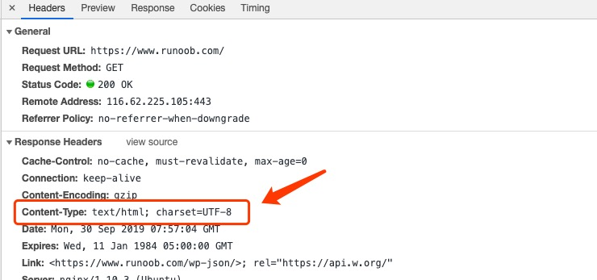

###Content-type
业务开发过程中 基于elementui 搞自定义的文件上传，涉及到这里，特此记录一下文件上传以及 content-type相关使用。

1. Content-type(内容类型):Content-type 一般指网页中存在的Content-type 用于定义网络文件的类型和网页的编码，决定浏览器将以什么形式 什么编码读取这个文件.
> Content-type: text/html;charset:utf-8
Content-type:multipart/form-data;boundary=something

常见的类型格式如下:
<ul>
<li>text/html (html格式)</li>
<li>text/plain (纯文本格式)</li>
<li>image/gif (gif图片格式)</li>
<li>image/jpeg (jpg图片格式)</li>
<li>image/png (png图片格式)</li>
<li>application/json (json格式)</li>
</ul>

https://juejin.im/post/6844903981291044872#heading-11
https://www.cnblogs.com/fixdq/articles/9337926.html
https://www.runoob.com/http/http-content-type.html
https://www.dazhuanlan.com/2019/11/15/5dcdafcb5636a/

https://juejin.im/post/6844903981291044872
https://www.dazhuanlan.com/2019/11/15/5dcdafc06f152/

https://www.cnblogs.com/liaopeng123/p/9879869.html