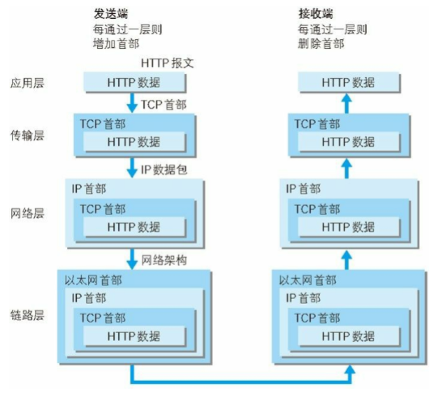
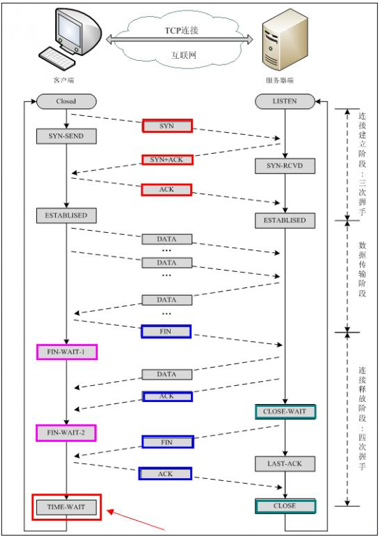
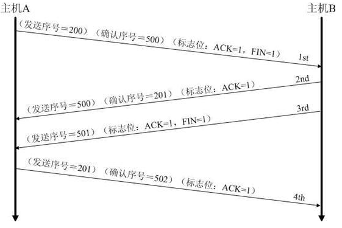
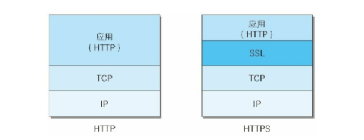
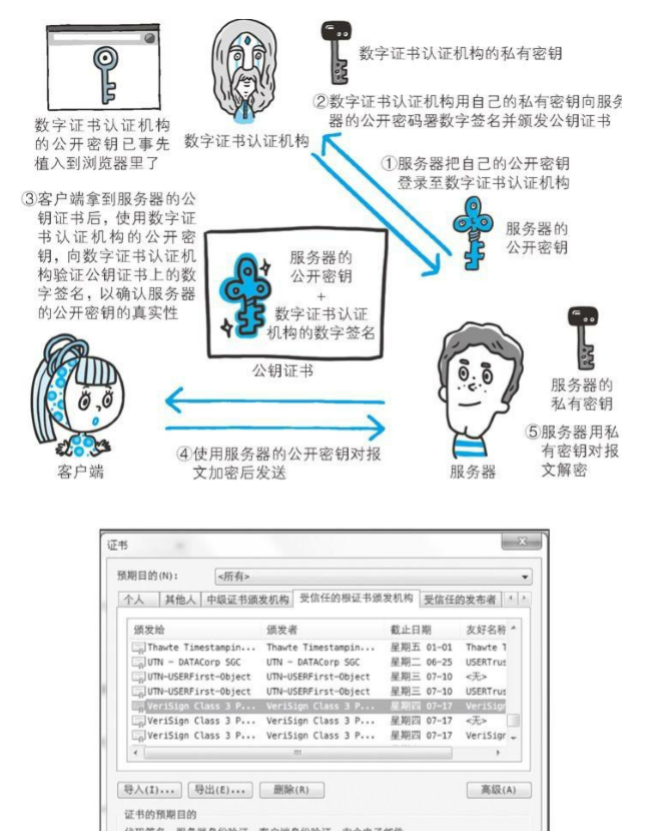
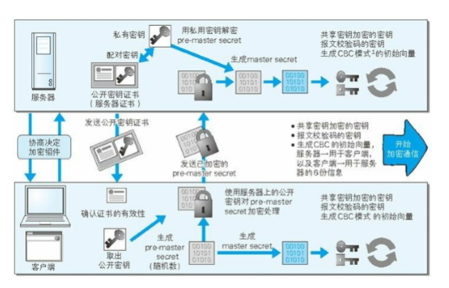

###图解http
#### 前言
关于http相关的概念一直都不是很明白，打算重新梳理复习一下http(s) 相关的计算机网络知识,通过这本书以及后续其他学习，由浅入深了解计算机网络

1. 网络基础tcp/ip
tcp/ip有着分层管理，并且从上到下分为四层:应用层、传输层、网络层、数据链路层。把tcp/ip 层次化是有好处的，如果互联网只有一个协议统筹，某个地方需要改变的时候 就必须把所有部分都替换掉，分层之后层层封装 只需要把有变动的改变就可以了，和我们封装代码的道理是相似的。
1.1 应用层， 应用层决定了向用户提供应用级服务通信的活动，这一层有各类通用的应用服务，ftp，http dns等
1.2 传输层，是应用层的下层，主要提供处于网络连接中的两台计算机之间的数据传输，再tcp传输层有两个不哦她那个的协议tcp(传输控制协议)),udp(用户数据报文),经典的问题,tcp三四握手 四次挥手 udp的缺点等等 
1.3 网络层(网络互连层),网络层用来处理再网络上流动的数据包，数据包是网络传输的最小数据单位，该层规定了通过怎样的路径(路由)到达对方计算机，典型的问题 ip 路由 等
1.4 链路层(数据链路层，网络接口层),用来处理连接网络的硬件部分

tcp/ip协议进行网络通信时会通过分层顺序与对方进行通信，发送端从应用层往下走 服务端网上，反过来一样
，为了方便传输在传输层tcp把从应用收到的数据进行分割并在各个报文打上序号标记及端口号转发给网络层， 在网络层 增加作为通信目的地的mac地址 后转发给链路层。 在传输数据的过程中 每经过一层必定会呗打上一个该层所属的首部信息，反之在接收层层传输时，会逐层的吧首部去掉

2. ip tcp dns关系
  按层次分,ip属于网络层，ip协议的作用就是指明了两个地址，用来指向数据要传送的地址，就是地址ip,mac，ip地址指明了节点被分配到的地址，mac地址指的是网卡所属的固定地址，ip地址可以和mac地址进行配对，ip可以换，但是mac地址基本不会变。
  而数据数据的传送主要靠路由器或交换机进行分段传送。这个过程就是路由选择 

  3. tcp的三次握手 四次挥手
   按层次分 tcp 位于传输层，提供可靠的字节流服务(为了方便传输将大块数据分割成以报文段为单位的数据包进行管理，而可靠的传输服务是指数据可以准确的发送过去)，巍峨了准确将数据送到,tcp就用到了三次握手 四次挥手的功能了。握手过程中使用了tcp标志，flag syn(synchronize同步) ack(acknowledegment,确认)
   

    第一次握手: 建立连接时，客户端发送sync包(x) 到服务器，并进入 syn_sent 同步请求状态 等待服务器确认
    第二次握手: 服务器收到sync包，必须确认客户的sync值(x+1)，同时自己发送一个sync包(y)， 此时服务器进入syn_recv状态
    第三次握手： 客户端收到服务器的syn，ack包，同时向服务器发送确认包ack(y+1)  证明客户端安全接受同步确认包 双方都进入  established状态 完成三次握手

    tcp的四次挥手

    因为tcp连接是全双工的，每个方向都要单独进行关闭，道理上就是 当一方完成数  据发送任务后，发送一个fin 来终止这一方向的链接，收到fin只是意味着这一方 向没有数据流动了，即不会收到数据了，但是这个tcp连接依然可以发送数据，直  到另一方也发送了fin，首先进行关闭的一方将执行主动关闭，而另一方则执行被 动关闭。

    第一次挥手 数据传输结束后，客户端的应用进程发出连接释放报文段fin=1, 并停止发送数据，其首部 fin=1 seq = u 这时候客户端还是可以接收数据的，

    第二次挥手 服务单收到连接释放报文段之后，发出确认报文 其首部 ack=u+1;seq =v; 此时本次连接就进入了半关闭状态，客户端不再向服务器发送数据。而服务器仍会继续发送

    第三次挥手 若服务器已经没有要向客户端发送的数据了，其应用进程就会释放tcp连接，这个阶段服务器所发出的最后一个报文的首部 应该是 fin=1; ack=1 seq=w ack=u+1

    第四次挥手 客户端收到连接释放报文段之后 必须发出 ack=1; seq=u+1;ack=w+1 在经过2msl（最长报文报文段寿命） 后 本次tcp连接真正结束 

 为什么不用两次握手?
 解：3次握手主要完成两个重要功能，既要双方做好发送数据的准备工作(双方都知道彼此已经准备好),也要允许双方就初始序列号进行协商，这个序列号在握手过程中被发送和确认
  选择把三次握手改成两次，死锁可能发生的，考虑计算机客户端(c)和服务器(s)之间的通信,假设c给s发送一个连接请求，s收到了这个请求 并发送了确认应答，按照两次握手得协定，s认为连接已经成功了 便开始发送数据，可是c在s答应请求运输得情况下 如果出了问题那就会出现这样一种场景，c不知道s是否已经准备好，也不知道s建立了什么样得序列号，c甚至怀疑s是否收到了自己得请求，在这种情况下c认为连接还未建立成功，会忽略s发来得任何数据，只等连接确认 而s在发出得数据超时后会继续发重复得数据 这样就出了问题了。 c端不确认建立连接，中途如果收到其他得s发送得数据 没有办法回应，会出现丢数据得问题

 

如果已经建立了链接 但是客户端发生了故障怎么办？
解： 客户端如果出现故障，服务器也不会一直等下去，服务器每收到一次客户端得请求后都会重新复位一个计时器，这个计时器通常设置为2h，2h之后还是没有收到客户端得任何数据，服务器就会发送一个探测报文段，以后每隔75s 发送一次 若是发送10个都没反应 那么就关闭了链接

tcp是面向连接的传输层协议 提供可靠的 全双工(接收和发送互不影响的，也就是我们平常说的上行速度和下行速度 像是打电话一样)，于此同时就是半双工 指的是一个时间段只能做一个动作，只能接收或者发送 

挥手为什么还要等2msl？ 
1.需要爆炸服务器收到了客户端收到了最后一条确认报文，假如这条报文丢失，服务器没有接收到确认报文，就会对连接释放报文进行超时重传，而此时客户端连接已经关闭，无法做出响应，就造成了服务器不停重传连接释放报文，而无法政策进入关闭状态状况，而等2msl 就可以保证服务器收到了最终确认，若服务器端没有收到，那么在2msl内客户端一定会收到服务器的重传报文 此时客户端就会重传确认报文，并重置计时器

为什么三次握手 四次挥手？

服务器端在listen状态下 收到建立连接请求的syn报文后， 把ack syn 放在一个报文段里发送给客户端，而关闭时 当收到了对方的fin时候 因为是双工的 他仅仅表示对方不在发送数据了 但是还能接收数据，而且己方也未必全部数据都发送给对方了，所以己方在可以检查一下应用层之后 如果没有数据可以发送了 就可以发送fin报文 来表示给地方同意了 关闭现在的链接 因此己方的ack 和fin都会分开发送

TCP UDP 的区别
1. 基于有连接和无连接，udp是无连接的 叫广播 发送数据不用建立连接 是不稳定的 有丢包的可能，tcp保证数据的准确性 tcp保证数据有顺序 udp有良好的实时性 效率比tcp高，使用对告诉传输和实时性有较高的通信或广播通信

 seq(序号):tcp连接字节流中每一个字节都会有一个编号，而本字段的值指的是本报文段所发送数据部分第一个字节的序号

 ack(确认号): 表示期望收到的下一个报文数据部分的第一个字节的编号，编号为ack-1即以前的字节已经收到 收到相应的数据了

 SYN(确认号): 当本字段为1 时 表示这是一个连接请求或者连接接受的报文
 ACK: 仅当字段为1 时 确认号才有效，acknowledge 同步确认
 FIN: 用来释放一个连接，当字段为1的时候，表示此报文段的发送端数据已经发送完毕，要求释放连接，注意因为tcp是双工的 所以才有这个 

###第二章 简单的http协议
1. http 是不保存状态的协议即无状态协议，http协议自身不对请求和响应之间的通信状态进行保存，协议对于发送过的请求或响应不做持久化处理。每当有新的请求发送时，就会有对应的新响应产生，协议本身并不保留之前一切的请求或响应报文的信息，这是为了更快处理事务。可是随着web发展，因无状态而导致业务处理变得棘手的情况增多了，比如用户登录购物网站，需要在跳转其他页面的同时保证这个登录的状态，既要保留无状态协议这个特征又要解决类似的客户端的状态的问题，所以引入cooike技术， cooike通过在请求和响应报文中写入cooike信息来控制客户端的状态。 给客户端一个特定的标识，在后面客户端请求的过程中会带上这个标识，服务器根据这个标识找到状态的信息，因为服务端保存所有的客户端状态是有负担的。cooike会根据从服务端发送的响应报文的一个叫做set-cooike 的首部字段信息 通过客户端保存cooike 当下次客户端再往服务器发送请求时，客户端会自动在请求报文中加入cooike后送出去，服务器在发现了客户端发送过来的cooike之后，会检查究竟是从哪个客户端发来的连接请求。然后对比服务器上的记录，最后得到之前的状态信息。

2. 持久化链接和管线化传输
持久化 keep-alive 现在的页面越来越复杂了，一个页面要请求多个资源，在以前的请求中都是一次请求，建立http链接过程，这样的话会造成很多无谓的tcp开销，毕竟http又要三次握手 四次挥手。索性搞一个持久化链接。简而言之就是只要建立了连接就可以直接一直的发送和请求资源而不是一直连接，断开之类的操作。   持久化链接的特点是，只要任意一端没有明确的提出断开链接，则保持tcp的链接状态。在http1.1中，所有的连接默认都是持久连接。

管线化： 持久连接使得多数请求以管线化方式发送成为了可能，从前发送请求后需要等待收到响应才能发送下一个请求，管线化技术出现后不用等待响应亦可直接发送下一个请求，这样就可以做到同时并行发送多个请求，而不需要一个接一个的等待响应了。表现出来的效果就是浏览器请求图片之类的资源可以并行的在资源服务器请求了。我的理解是：在不支持 持久化链接的年代
请求资源过程就是这样的， 建立请求-> 请求/响应数据 -> 断开链接。  这样的话每次都只能发送一个请求，一个响应 这样一次http的建立释放流程就算完成。而现在http1.1支持了 持久化链接之后流程就变成了这样： 建立请求-> n * (请求/响应数据) -> 断开链接。在这个传输数据的过程可以多次请求和响应数据 这样就自然的可以用到了管线化技术了 ，并且彼此之间的请求互不影响，这样提高了网络效率。

3. 返回结果的http状态码
  204 no content- 请求成功但是没有资源可返回，该状态码代表服务器接收的请求已经成功返回，但在返回的响应报文中不含实体的主体部分，另外，也不允许返回任何实体的主体，比如从浏览器发出请求处理后 返回204响应，那么浏览器显示的页面不发生更新
  206 partial content  请求部分内容,该状态码表示客户端进行了范围请求，而服务器成功执行了这部分的get请求，响应报文中包含了由content-range指定范围的实体内容

  3xx 重定向，表示浏览器需要执行某些特殊的处理以正确处理请求
  301 永久重定向，该状态码表示请求的资源已经被分配了新的uri，浏览器在拿到服务器返回的这个状态码之后会自动跳转到一个新的url地址。
  302 临时重定向，该状态码表示请求的资源已经被分配了新的uri，与301相似
  304 not modified 一般用于客户端的缓存,该状态码表示客户端发送 附带条件的请求时，服务器端允许请求访问资源，但未满足条件的情况，304状态码返回时，不包含任何响应的主体部分，304虽然被划分在3xx类别中，但是和重定向没有关联 比如

  4xx 客户端错误 一般是客户端的错误，不过在平时的开发中 也有后端处理不当的情况

  400 bad request  该状态码表示请求报文中存在语法错误，当错误发生的时候 需要修改请求的内容后再次发送请求，

  401 unauthorized 未授权
  403 forbidden 未获得文件系统的访问权限，访问权限出现某些问题（从未授权的发送源ip地址访问）等情况都可能是发生403原因

  5xx 服务器错误 
  500 internal server error  后端服务出现故障
  503 该状态码表明服务器暂时处于超负载或者正在停机维护的状态 无法处理请求，

4. 与http协作的web服务器
 一台web服务器可搭建多个独立域名的web网站，也可以作为路径上的中转服务器提升传输效率  
 http规范允许一台http服务器搭建多个web站点，比如使用web托管服务，可以用一台服务器为多为客户服务，也可以为每位客户持有的域名运行各自不同的网站，这是因为利用了虚拟服务器功能 即使物理层只有一台服务器 但只要使用了虚拟主机的功能 也可以架设棋多台服务器

 代理： 一种有转发功能的应用程序，它扮演了位于服务器和客户端‘中间人’角色，接收由客户端发送的请求并转发给服务器同时也接收服务器返回的响应转发给客户端，代理包含正反代理，同时使用代理服务器的理由：使用cdn缓存技术可以就近取资源， 组织内部针对特定网站的访问控制。
 缓存代理： 代理转发响应，缓存代理会预先将资源的副本保存在代理服务器上。当代理再次接收到对相同资源的请求时，就可以不从源服务器那里取资源，而是将之前缓存的资源作为响应返回  。 对比透明代理 就是不对报文做任何加工的代理类型就是透明代理

 网关： 网关的工作机制和代理相似，区别在于网关能使通信线路上的服务器提供非http协议服务，利用网关可以由http请求转化为其他协议通信 比如http转换为sip协议 使用freeswtich工具等等

 隧道： 隧道可按要求建立起一条与其他服务器的通信线路，届时使用ssl等加密手段进行通信，隧道的目的就是确保客户端能与服务器进行安全的通信，隧道本身不会去解析http请求，也就是请求保持原样中转给服务器

5. http首部
    http 协议的请求和响应报文中 必定包含http首部，http首部分为  报文首部（http头，客户端和服务器处理时气到信息通知的作用），报文主体（用户和服务器所需要的资源信息）

    通用首部字段:

    |首部字段名|说明|
    |:----|---:|
    |cache-control|控制缓存行为|
    |connection|逐跳首部、连接的管理|
    |date|创建报文的日期时间|
    |pragma|报文指令|
    |via|代理服务器相关信息|
    |upgrade|升级为其他协议|

    http请求报文: 
    |请求字段名|说明|
    |:----|---:|
    |accept|用户代理可处理的媒体类型|
    |accept-charset|有限的字符集|
    |accept-encoding|优先的内容编码|
    |authorization|web认证信息|
    |host|请求资源所在的服务器|
    |if-match|比较实体标记(Etag)|
    |if-modify-since|比较资源的更新时间|
    |if-none-match|比较实体标记(与if-match相反)|
    |referer|对请求中uri的原始获取方|
    |user-agent|客户端信息，Mozilla/5.0 (Windows NT 6.1; WOW64; rv:13.0) Gecko/20100101 Firefox/13.0.1|

    http响应报文: 
    |响应字段名|说明|
    |:----|---:|
    |age|推算资源创建经过时间|
    |etag|资源的匹配信息|
    |location|令客户端重定向至指定uri|
  
    http实体首部报文: 
    |实体首部字段名|说明|
    |:----|---:|
    |allow|资源可支持的http方法|
    |content-encoding|实体适用的编码方式|
    |content-length|实体主体的大小（字节）15000|
    |content-type|实体主体的媒体类型（最常用）text/html;charset=utf-8 application/json,application/x-www-form-urlencoded,|
    |expires|实体主体过期的时间|
    |last-modified|资源的最后修改时间|

    还有部分非http1.1首部字段例如 cooike set-cooike 等
    关于表单格式enctype属性和请求头content-type有关系, 他可能有几种值 application/x-www-form-urlcoded, multipart/form-data,text/plain。属性默认值是 application/x-www-form-urlencoded(表示普通的form表单元素提交，在发送前编码所有字符，提交的参数格式遵循name=value&name=value)

    multipart/form-data: 表示不对字符编码直接提交二进制文件流 在使用包含文件上传form表单时，必须使用该值
    text/plain: 表示空格转换为 + 但不对特殊字符编码
    当使用form表单上传文件时post请求的时候，需要在form表单中添加enctype='multipart/form-data',请求头中有一个content-type字段，会生命数据编码格式 浏览器会自动添加content-type:multipart/form-data,
    如果form 中没有指定enctype 浏览器会自动添加默认的  content -type: application/x-www-form-urlencoded;charset=utf-8

6. 确保web安全的https
  1.http 本身是不够安全的它使用的是明文，所以在通信过程中会存在报文被监听或者篡改的可能性。所以需要使用 http+认证+ 加密 + 完整性保护 = https
  2.https是身披ssl外壳的http,https并非是应用层的一种新协议，只是http通信接口部分用ssl tls协议代替而已，通常http直接和tcp通信 当https时则是 http应用层和ssl先进行通信 再由ssl和tcp通信    
  
  3.关于对称加密和非对称加密： 对称加密也可以叫共享秘钥加密，即双方使用同一个秘钥。非对称加密又叫 公开秘钥加密即 双发都有自己的一套 密码库(公钥，私钥 私钥用来解密公钥加密后的信息)，双发都把自己的公钥发给对方，让对方使用自己发出去的公钥进行加密，当收到对方发过来的信息之后用自己的私钥进行解密 从而保证密码的安全性。 https就是使用了混合加密的方法即两种都用，在建立安全的信息通道之前使用 非对称，在建立成功后使用对称加密，对称加密的效率更高，对cpu的性能要求低
  4.遗憾的是纯粹使用对称非对称加密的方式还是无法保证中间不会被篡改，因为双方在沟通的过程中假设有一个中间人 同时将双方的公钥都给截获了 同时伪装成对方，监听并修改信息内容，这是一个很可怕的场景。 所以为了解决上述的问题，目前市场上有 数字证书认证机构和相关可以颁发给服务器公开秘钥证书的机构，有一个靠谱的第三方机构可以尽可能的降低信息被篡改和监听的风险
  5.过程如下:
  
  注意：值得信赖的第三方机构介入认证，才能让已植入在浏览器内的认证机构颁布的公开秘钥发挥作用，并借此证明服务器的真实性。
  6.https 通信流程图
  
  在确立通信完成之后才进行tcp的三次握手，前面的步骤目的就是为了建立一个安全的加密的信息通道过程

7. WEB安全
在web应用中，从浏览器那接收到的http请求的内容，都可以在客户端自由地变更、篡改所以web应用可能会收到与预期数据不同的内容，在http请求报文内加载攻击代码，就能发起对web应用的攻击，通过url查询字段或表单、http首部 cooike等途径把攻击代码传入服务器中。
主动攻击：以服务器为目标的主动攻击，攻击者直接访问web应用 把攻击代码传入的攻击模式，主动攻击模式具有代表性的是sql注入攻击和os命令注入攻击 
被动攻击： 以服务器为目标的被动攻击，利用圈套或者策略执行攻击代码 不直接对服务器攻击，利用客户端进行攻击。被动攻击模式中具有待报销的攻击是跨站脚本攻击和跨站请求伪造

   1. 跨站脚本攻击： 通过在 存在安全漏洞的web网站注册用户的浏览器内  运行非法的html标签或者js进行的一种攻击，适用于动态创建html的网站类型， 动态创建的html部分很可能隐藏着安全漏洞，就这样 攻击者编写脚本陷阱，用户在自己的浏览器上运行时 一不小心就会受到被动攻击。
    跨站脚本攻击属于被动攻击模式，因此攻击者会事先布置好用于攻击的陷阱，例如给search  添加一些非法输入内
> 如: >
    这样服务器在渲染的时候会把一些代码执行了同时生成一个新的js标签

感谢其他链接的分享
https://cloud.tencent.com/developer/news/257281
https://juejin.im/post/5df7959051882512480a83e7 https 加密