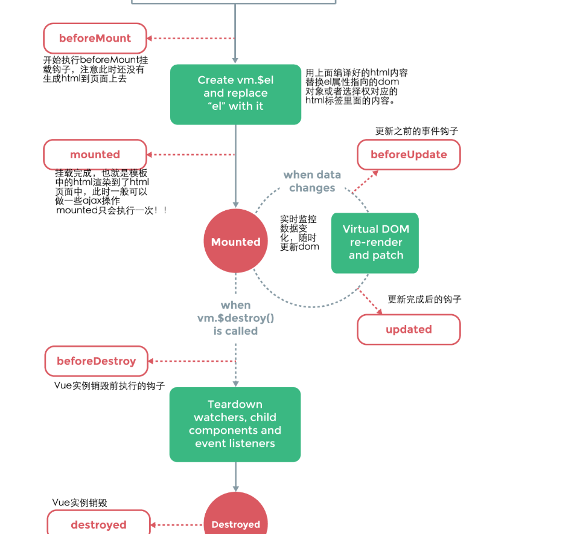

1. null 和undefined的区别：null代表一个空对象指针，使用typeof null 可以得到object，而undefined是一个类型，表示声明了一个变量而没有初始化时，得到的是undefined
2. js中 == 和 === 的区别：==代表相同，= = =代表严格相同，当进行双等号比较时候，先检查两个操作数数据类型，如果相同，则进行= = =比较，如果不同则愿意为你进行一次类型转换，转换称相同类型后再进行比较，而= = =比较时如果类型不同，直接返回false。 所以= = =效率更高，毕竟少做了一步操作。
3. promise和settimeout 哪个先执行 settimeout在下一轮‘事件循环’开始时执行，promise内部会在本轮事件循环执行，而then属于微任务在本轮‘事件循环’结束的时候执行，
4. 清除浮动的方式有哪些？
  清除浮动主要是为了解决 父元素因为子级元素浮动引起的内部高度为0的问题，当父元素不给高度的时候，内部元素不浮动时会撑开，而浮动的时候 父元素变成一条线
    1. 额外标签法：在最后一个浮动标签后新建一个无意义的标签 样式设置为clear"both
    2. 使用after  伪元素清楚浮动给父元素添加 .clear:after{content:'',display:block,height:0,clear:both,visibility:hidden}
5. css有哪些经典的布局方式？
6. 说一下对跨域的理解 如何解决跨域 1.
7. 事件流？ 事件捕获？ 事件冒泡？：dom事件流将事件分为三个阶段，捕获阶段，目标阶段，冒泡阶段。先调用捕获阶段的处理函数，在调用目标阶段的处理函数，最后调用冒泡阶段的处理函数
8. 什么是闭包？闭包的作用是什么？
9. 提升界面性能的方法
10. vue双向数据绑定的原理是什么
    采用数据劫持结合发布者-订阅者模式的方式，通过object.defineproperty来劫持各个属性的setter和getter，当data中某个属性被访问时，调用getter方法或者setter方法， vue同时还会对每个元素节点的指令进行解析，替换模板数据，并绑定对应更新函数。
11. vue组件 间的通讯方式有哪些:
    1. 使用props和$emit 进行组件间数据传递， 父传子：子组件中props定义好要接受的数据，父组件使用v-bind传递子组件props中定义好的数据
    子传父$emit('自定义事件名',arguments)子组件使用$emit自定义事件及参数，父组件监听自定义事件并相应业务处理
    2. 中央事件总线进行组件间的通信，当组件不是父子关系时，可以用,let bus =new Vue()
     创建事件总线， bus.$emit('自定义事件名',eventHandler)使用bus。$on 在组件的mounted阶段监听自定义事件并在回调函数eventhandler中做相应的处理
    3. redux
12. 使用vue 的时候有哪些点可能会影响整体的渲染性能
13. webpack打包原理？ ： webpack是一个模块打包机，通过分析各个资源和模块的依赖关系，将他们建立起来一种联系， 把所有的文件打包成一个或者多个bundle.js 通过代码分割但愿片段 并按需加载， wepback将一切资源视为模块，
    而gulp 是一种能够优化前端开发流程的工具，而webpack是一种模块化的解决方案，
14. webpack优化
15. vueredux相关
16. react如何做优化
17. vue生命周期：vue实例有一个完整的生命周期，也就是从开        始创建、初始化数据、编译模板 挂载dom 渲染-更新-渲染 卸载 这一系列的过程，在vue的整个生命周期中，提供了让我们可以注册js的方法，
    
    
     beforecreate : 在实例初始化后 数据观测和event/watcher事件配置之前被调用
     created: 实例已经完成创建之后被调用，实例完成以下配置：数据观测，属性和方法的运算，watch/event事件回调，然而 挂载阶段还没开始，$el属性不可见   
    beforemount:挂载前被调用
    mounted: 挂载到实例上去之后使用该钩子，
    beforeupdate: 数据更新时调用，发生在虚拟dom重新渲染和打补丁之前，可以在这个钩子中进一步地更改状态，这不会触发附加的重渲染过程
    updated 数据更改会导致虚拟dom重新渲染和打补丁，这个钩子被调用时 dom已经更新完
    beforedestory: 实例销毁之前调用，在这一步实例仍然完全可用
    destoyed: vue实例销毁
18. method ，watch，computed区别
    computed是计算属性，methods是方法 他们都可以实现对data中的数据加工后再输出。不同的是computed计算属性是基于他们的依赖进行缓存的，computed只有在它的相关依赖发生改变时才会重新求值，而methods每次执行都是独立的，假设有一个性能开销大的属性A，并且后面可能会用到a的 那么就要使用。而watch是监听一个值只要这个值发生改变，就会执行相关的依赖，。
19. mvvm的理解:
    model view viewmodel 三部分构成，model 代表数据模型，也可以在model中定义数据修改和操作的业务逻辑，view代表ui组件，它负责将数据模型转化成ui展现出来，viewmodel是一个同步view和model的对象
    mvvm架构下 view和model之间并没有直接联系，而是通过viewmodel 进行交互，model和viewmodel之间的交互是双向的，因此view数据的变化会同步到model中，而model数据的变化也会立即反应到view上
20. vue路由相关 以及传参的方式，导航钩子？
     1. 全局导航守卫，router.beforeeach(to,from,next)跳转前进行拦截，
21. 常见指令
22. slot插槽: 就是将组件内所需要的内容以插槽的形式插入到公共组件中，以达到灵活的控制
23. 直接对对象属性进行添加或者删除会不会响应到试图中，要用this.$set(),比如直接对对象属性进行添加或者删除是不会响应到视图中的， 
24. keep-alive：包裹动态组件时会缓存不活动的组件实例，主要用于保留组件状态或者避免重新渲染
25. exact严格模式 必须完全匹配路由才行
26. vue哪些点可能会影响整体渲染性能？ 列表大数据，没有进行代码分割，路由不使用懒加载 指令运用不合理 遍历数据不使用key watch过多属性，资源不压缩 
27. computed 本质上和watch 没有区别，都是把特定的data 放入监听，所以当里面的数据（即使没有用到的脏实例数据）发生改变仍然会触发computed和watch
28. 当父组件中的实例属性发生变化的话 尽管没有影响到子组件，vue和react的话都会发生渲染，因为他是递归渲染的 其实是可以控制的

/**
  extensions is an Array and each item has such format:
  {firstName: 'xxx', lastName: 'xxx', ext: 'xxx', extType: 'xxx'}
  lastName, ext can be empty, extType can only has "DigitalUser", "VirtualUser","FaxUser","Dept","AO".
**/

/**
  Question 1: sort extensions by "firstName" + "lastName" + "ext" ASC
**/
function sortExtensionsByName(extensions) {
	return  extensions.sort((a, b) => {
     const pre = `${a.firstName}${a.lastName}${a.ext}`;
     const next = `${b.firstName}${b.lastName}${b.ext}`;
     return pre > next;
  })
}

/**
  Question 2: sort extensions by extType follow these orders ASC
  DigitalUser < VirtualUser < FaxUser < AO < Dept.
**/
function sortExtensionsByExtType(extensions) {
  const sortMap = new Map([
    ['DigitalUser', 1],
    ['VirtualUser', 2],
    ['FaxUser', 3],
    ['AO', 4],
    ['Dept', 5]
  ]);

  return extensions.sort((a, b) => {
    return sortMap.get(a.extType) - sortMap.get(b.extType);
  });
}

/**
  saleItems is an Array has each item has such format:
  {
	month: n, //[1-12],
	date: n, //[1-31],
	transationId: "xxx",
	salePrice: number
  }
**/

/**
  Question 3: write a function to calculate and return a list of total sales (sum) for each quarter, expected result like:
  [
  	{quarter: 1, totalPrices: xxx, transactionNums: n},
  	{....}
  ]
**/

function sumByQuarter(saleItems) {
  const map = {};
  const { ceil } = Math;
  saleItems.forEach((item) => {
    const quarter = ceil(item.month / 3);
    
    if (map[quarter]) {
        map[quarter].totalPrices += item.salePrice;
        map[quarter].transactionNums += 1;
    }
    else {
      map[quarter] = {
        quarter,
        totalPrices: item.salePrice,
        transactionNums: 1,
      }
    }
  });

  return Object.values(map);
}

/**
  Question 4: write a function to calculate and return a list of average sales for each quarter, expected result like:
  [
    {quarter: 1, averagePrices: xxx, transactionNums: n},
    {....}
  ]
**/

function averageByQuarter(saleItems) {
  const map = {};
  const { ceil } = Math;
  saleItems.forEach((item) => {
    const quarter = ceil(item.month / 3);
    
    if (map[quarter]) {
        const { averagePrices, transactionNums } = map[quarter];
        const tNums = transactionNums + 1;
        map[quarter].averagePrices += ((item.salePrice - averagePrices) / tNums);
        map[quarter].transactionNums = tNums;
    }
    else {
      map[quarter] = {
        quarter,
        averagePrices: item.salePrice,
        transactionNums: 1,
      }
    }
  });

  return Object.values(map);
}

/**
  Question 5: please create a tool to generate Sequence
  Expected to be used like:
  var sequence1 = new Sequence();
  sequence1.next() --> return 1;
  sequence1.next() --> return 2;
  
  in another module:
  var sequence2 = new Sequence();
  sequence2.next() --> 3;
  sequence2.next() --> 4;
**/
let _value = 0;
class Sequence {
  next() {
    return this.unique;
  }
};
Object.defineProperty(Sequence.prototype, 'unique', {
  get() {
    _value += 1;
    return _value;
  }
})

/**
    Question 6:
    AllKeys: 0-9;
    usedKeys: an array to store all used keys like [2,3,4];
    We want to get an array which contains all the unused keys,in this example it would be: [0,1,5,6,7,8,9]
**/

function getUnUsedKeys(allKeys, usedKeys) {
  const s = new Set(usedKeys);
  return allKeys.filter(key => !s.has(key));
}

（1）计算数组中每个元素出现的次数
let names = ['Alice', 'Bob', 'Tiff', 'Bruce', 'Alice'];

let nameNum = names.reduce((pre,cur)=>{
  if(cur in pre){
    pre[cur]++
  }else{
    pre[cur] = 1 
  }
  return pre
},{})
console.log(nameNum); //{Alice: 2, Bob: 1, Tiff: 1, Bruce: 1}

（2）数组去重
let arr = [1,2,3,4,4,1]
let newArr = arr.reduce((pre,cur)=>{
    if(!pre.includes(cur)){
      return pre.concat(cur)
    }else{
      return pre
    }
},[])
console.log(newArr);// [1, 2, 3, 4]

function qSort(arr) {
  //声明并初始化左边的数组和右边的数组
  var left = [], right = []
  //使用数组最后一个元素作为基准值
  var base = arr[arr.length - 1]
  //当数组长度只有1或者为空时，直接返回数组，不需要排序
  if(arr.length <= 1) return arr
  
  //进行遍历
  for(var i = 0, len = arr.length; i < len - 1; i++) {
    if(arr[i] <= base) {
    //如果小于基准值，push到左边的数组
      left.push(arr[i])
    } else {
    //如果大于基准值，push到右边的数组
      right.push(arr[i])
    }
  }
  //递归并且合并数组元素
  return [...qSort(left), ...[base], ...qSort(right)]
}
const arr = [2, 4, 1, 5, 3, 1]
const s = qSort(arr)

console.log(s) // [1, 1, 2, 3, 4, 5]

感谢以下链接的分享：
https://www.jianshu.com/p/5f9cef0bfa51
https://www.jianshu.com/p/42a4be57287f?utm_campaign